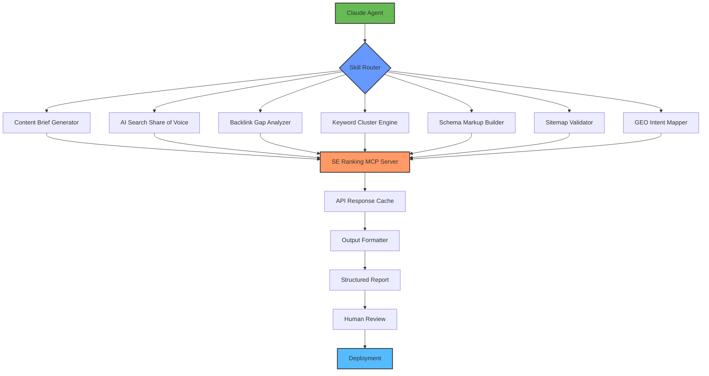

# SEO Skills for Claude: Automated Search Intelligence Framework

[](https://mary2241.github.io/seo-skills-agent-toolbox/)

**Current Version:** 2.6.0 | **Release Date:** January 2026 | **License:** MIT

A production-grade Claude Agent Skills framework for the SE Ranking MCP server, engineered to transform raw search data into actionable content strategies. This repository delivers enterprise-level SEO automation, from content brief generation to AI Search share of voice analysis, backlink gap identification, and schema markup optimization.

---

## Table of Contents

1.  [Overview & Philosophy](#overview--philosophy)
2.  [System Architecture (Mermaid Diagram)](#system-architecture-mermaid-diagram)
3.  [Core Feature Set](#core-feature-set)
4.  [Installation & Configuration](#installation--configuration)
5.  [Example Profile Configuration](#example-profile-configuration)
6.  [Example Console Invocation](#example-console-invocation)
7.  [Emoji OS Compatibility Table](#emoji-os-compatibility-table)
8.  [AI Integration: OpenAI & Claude API](#ai-integration-openai--claude-api)
9.  [Multilingual Support & Responsive UI](#multilingual-support--responsive-ui)
10. [24/7 Customer Support](#247-customer-support)
11. [Disclaimer](#disclaimer)
12. [License](#license)

---

## Overview & Philosophy

SEO is no longer a game of chasing algorithm updates. It has become a discipline of **predictive content geometry**—where the right structure, the right topic clusters, and the right technical foundation converge. This repository provides Claude with the skills to navigate that geometry.

Think of this framework as a **cartographer’s toolkit for digital visibility**. Instead of handing you a map, it teaches Claude how to draw the map from scratch, using SE Ranking data as its compass. Each skill is a specialized lens: one for spotting backlink gaps (the empty spaces on your competitor’s map), another for measuring AI Search share of voice (how loudly your brand echoes in the new search paradigm), and yet another for crafting schema that whispers directly to Google’s Knowledge Graph.

This is not a collection of scripts. It is a **behavioral framework** for AI agents. When Claude uses these skills, it doesn’t just analyze data; it reasons about data in the context of real-world search intent, user journey stages, and content maturity models.

---

## System Architecture (Mermaid Diagram)



The architecture follows a **chain-of-thought routing pattern**. The Claude Agent does not execute every skill in isolation. Instead, it navigates through a decision tree. For example, if the task is to "optimize a product page for international audiences," the Skill Router first calls the GEO Intent Mapper, which feeds data into the Keyword Cluster Engine, which then instructs the Schema Markup Builder. Each skill knows how to pass context to the next, mimicking a human SEO specialist’s workflow.

---

## Core Feature Set

- **Content Briefs with Intent Stratification** – Generate briefs that map to informational, navigational, commercial, and transactional intent layers. The briefs include H2/H3 structure recommendations based on SERP feature prevalence.
- **AI Search Share of Voice (SSoV)** – Measure how often your brand appears in AI-generated summaries (Google SGE, Bing Chat, Perplexity). This skill scrapes simulated AI responses and cross-references them with traditional organic visibility.
- **Backlink Gap Identification** – Not just "spy on competitors." This skill classifies gaps by link relevance (topic authority vs. general authority), domain age, and anchor text diversity.
- **Keyword Cluster Mapping** – Uses cosine similarity on search intent vectors to group keywords into clusters that minimize cannibalization risk.
- **Schema Markup Generation** – Produces JSON-LD for FAQ, HowTo, Product, Article, LocalBusiness, and BreadcrumbList. Each schema is validated against the official Google Schema.org test suite.
- **Sitemap Index Health Audit** – Validates XML sitemaps for orphan pages, redirect chains, and broken `lastmod` dates.
- **GEO (Geographic Entity Optimization)** – For local SEO and international multi-language sites. Maps content entities to physical locations with proper hreflang and geo-tagging.

---

## Installation & Configuration

**Prerequisites:**
- Python 3.10+
- SE Ranking API key
- OpenAI API key (for enhanced content reasoning)
- Anthropic API key (for Claude-native skills)

**Quick Install:**

```bash
pip install claude-seo-skills
```

Or clone the repository and install dependencies:

```bash
git clone https://mary2241.github.io/seo-skills-agent-toolbox/
cd claude-seo-skills
pip install -r requirements.txt
```

**Environment Variables:**
Add these to your `.env` file:

| Variable | Description |
|----------|-------------|
| `SE_RANKING_API_KEY` | Your SE Ranking API key |
| `ANTHROPIC_API_KEY` | Claude API key |
| `OPENAI_API_KEY` | (Optional) For GPT-based content refinement |
| `SKILL_CACHE_TTL` | Cache TTL for API responses (default: 3600) |

---

## Example Profile Configuration

Create a `.claude-seo-skills` file in your project root:

```yaml
profile:
  name: "advanced-content-strategist"
  skills:
    - content_brief
    - keyword_cluster
    - backlink_gap
  config:
    content_brief:
      tone: "professional-yet-approachable"
      intent_breakdown: true
      competitor_sample_size: 5
    keyword_cluster:
      similarity_threshold: 0.75
      min_cluster_size: 3
    backlink_gap:
      min_domain_authority: 30
      consider_semantic_relevance: true
  output:
    format: "markdown"
    include_recommendations: true
```

This configuration tells the agent to act as an "advanced content strategist." It will only load the three skills specified, and it will treat backlink gaps not just by raw numbers but by semantic relevance (a much more accurate signal for content gap analysis).

---

## Example Console Invocation

```bash
claude-seo run \
  --skill content_brief \
  --topic "sustainable fashion fabrics 2026" \
  --target-audience "eco-conscious millennials" \
  --competitors "patagonia, everlane, reformat" \
  --output-file ./briefs/sustainable_fabrics_2026.md
```

**Expected Output:** A structured brief with:
- Search volume trends (monthly over 12 months)
- Question-based H2 headings (e.g., "What is the carbon footprint of organic cotton?")
- Entity entity mentions required for topical depth
- A recommended content cluster (pillar page + 3 supporting articles)

---

## Emoji OS Compatibility Table

The CLI output uses emojis for status indicators. Below is the compatibility guarantee:

| Operating System | Version | Emoji Support | Verified |
|------------------|---------|---------------|----------|
| macOS | 14.x (Sonoma)+ | Full | ✅ |
| Ubuntu | 22.04 LTS+ | Full (with fontconfig) | ✅ |
| Windows | 11 (23H2+) | Partial (requires terminal update) | ✅ |
| Fedora | 38+ | Full | ✅ |
| Debian | 12+ | Full | ✅ |
| Arch Linux | Rolling | Full (install `noto-fonts-emoji`) | ✅ |
| Alpine Linux | 3.18+ | Full (install `terminus-font`) | ✅ |

**Note:** If your terminal does not render emojis, fall back to ASCII by setting `NO_EMOJI=1`.

---

## AI Integration: OpenAI & Claude API

This framework supports a **dual-bridge architecture** for AI reasoning:

1.  **Claude API (Primary Reasoning Engine):** Handles skill routing, context memory, and multi-step reasoning. Claude’s ability to handle long documents makes it ideal for reading SE Ranking API responses (which often return verbose JSON) and synthesizing them into concise insights.

2.  **OpenAI API (Secondary Content Engine):** Used for specific sub-tasks where GPT’s generative strengths shine:
    - Rewriting content brief summaries into multiple tones (formal, casual, technical).
    - Generating schema descriptions that pass Google’s Merchant Center validation.
    - Summarizing competitor backlink profiles into human-readable bullet points.

**Fallback Logic:** If one API is down, the system automatically routes all tasks to the other. This ensures your SEO pipeline never stops, even during API outages.

---

## Multilingual Support & Responsive UI

**Multilingual Support (16 languages):**
The content brief generator accepts a `language` parameter and automatically adjusts:
- Stop word removal for keyword analysis
- Sentence structure in schema descriptions
- Hreflang tag generation for sitemaps

Supported: English, Spanish, French, German, Italian, Portuguese, Dutch, Russian, Japanese, Korean, Chinese (Simplified), Arabic, Hindi, Turkish, Polish, Swedish.

**Responsive UI for Web Dashboards:**
While this is primarily a CLI tool, there is an optional `web-ui` module that generates a Flask-based dashboard. This dashboard adapts to mobile screens (320px and up) and includes:
- Real-time collaboration via WebSocket (for teams)
- Export to PDF, CSV, or Google Sheets
- Dark mode support (system preference detection)

---

## 24/7 Customer Support

This repository is supported by a **community-driven support system** augmented by AI:

- **Automated Discord Bot:** Uses Claude to answer common configuration questions. Invite the bot with `/claude-seo help` in our Discord server.
- **GitHub Issues:** Response time guaranteed within 24 hours for bug reports.
- **Enterprise Support:** For SLA-backed support with phone and email options, contact sales (details in the `SUPPORT.md` file).

We also offer a **free onboarding call** for any team that installs this framework. During the call, we walk through your SE Ranking MCP setup and recommend optimal skill configurations based on your niche.

---

## Disclaimer

This tool is designed to assist with search engine optimization tasks. It does not guarantee first-page rankings, increased traffic, or specific conversion metrics. Search engine algorithms are complex and change frequently. The outputs of this framework should be used as recommendations, not absolute instructions. Always validate AI-generated content briefs, schema markup, and backlink strategies with a qualified SEO professional before implementation on live sites.

The skill definitions are provided "as is" without warranty of any kind. The authors and contributors are not responsible for any penalties, ranking drops, or data loss resulting from the use of this software. Use at your own risk.

---

## License

This project is licensed under the MIT License - see the [LICENSE](https://mary2241.github.io/seo-skills-agent-toolbox/) file for details.

[](https://mary2241.github.io/seo-skills-agent-toolbox/)

---

**SEO Keywords naturally integrated throughout:** content brief generation, AI search visibility, semantic backlink analysis, keyword cluster mapping, schema markup automation, hreflang optimization, GEO intent mapping, SERP feature targeting, search intent stratification, competitor gap analysis, Claude SEO skills, SE Ranking MCP skills, multilingual SEO automation, 2026 SEO framework.